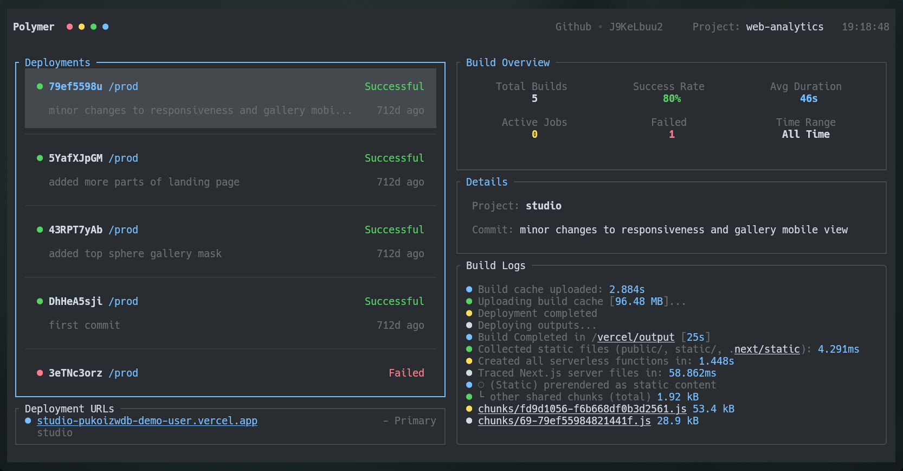
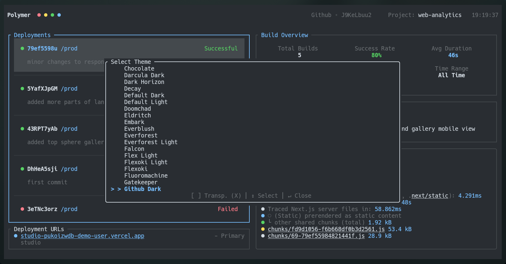
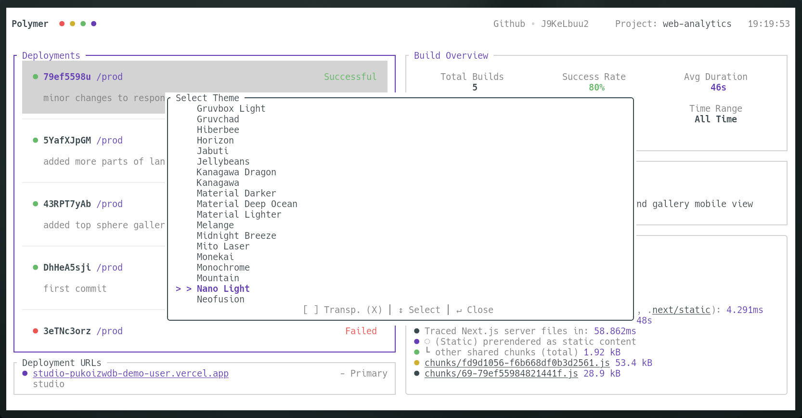
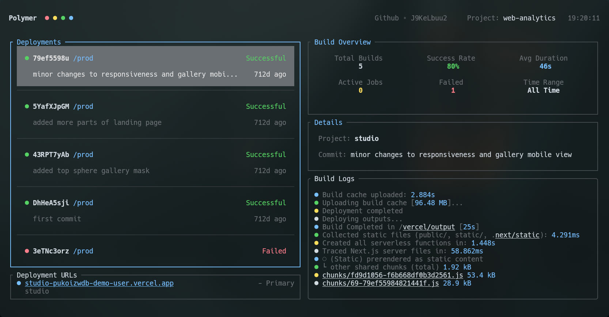

# Polymer

> A terminal interface for Vercel with a lot of themes.

Polymer is a terminal interface for Vercel. It allows you to monitor deployments, view build logs, and manage your projects from your terminal. Built with Rust and Ratatui.



> Deployment overview with build status, logs, and statistics

## Features

- **Monitoring**: Visibility into your deployments and their states.
- **Logs**: Stream build logs directly in your terminal.
- **Themes**: Customizable appearance with coverage for many themes and transparency support.
- **Quick Actions**: Open deployments in your browser, switch projects, or change time periods.
- **Mouse Support**: Interaction for scrolling and clicking.
- **Secure**: Uses Vercel's official Personal Access Token flow. All data is stored locally on your machine.

## Gallery

| | |
|:---:|:---:|
|  |  |
|  |  |

> Project selection and theme selection

## Installation

### From Source

```bash
cargo install --path .
```

## Usage

Run the application from your terminal:

```bash
polymer
```

### Authentication
On the first run, Polymer will guide you through the authentication process. You'll need to generate a Vercel Access Token with "Full Account" scope and paste it into the prompt.

### Keybindings

| Key | Action |
| :--- | :--- |
| **Navigation** | |
| `↑` / `k` | Navigate Up |
| `↓` / `j` | Navigate Down |
| `g` / `G` | Jump to Top / Bottom |
| `←` / `h` | Focus Deployments |
| `→` / `l` | Focus Logs |
| `Enter` | View logs for selected deployment |
| **Actions** | |
| `/` | Filter Deployments by Branch |
| `r` | Redeploy selected (from same commit) |
| `k` | Cancel selected (if building) |
| `o` | Open selected deployment in browser |
| `p` | Open Project Switcher |
| `t` | Open Theme Selector |
| `s` | Cycle Statistics Period (24h, 7d, 30d, All) |
| `m` | Toggle Mouse Support |
| `Space` | Toggle Keybind Legend |
| `q` | Quit Application |

### Theme Selector Controls
When the Theme Selector is open (`t`):
- `↑` / `↓`: Browse themes.
- `Enter` / `Esc`: Close selector.
- `x`: Toggle Background Transparency.

## Configuration

Polymer stores its configuration and auth token locally in your operating system's standard configuration directory.
- **Linux**: `~/.config/polymer/config.json`
- **macOS**: `~/Library/Application Support/com.polymer.polymer/config.json`
- **Windows**: `AppData\Roaming\polymer\config.json`

## License

MIT
